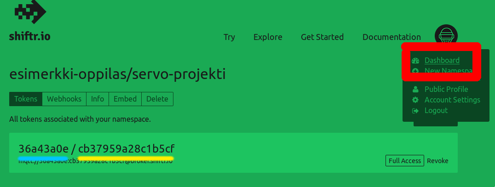

# Shiftr.io ohje

## Shiftr.io tilin luominen
1. Mene [Shiftr.io](https://shiftr.io):n sivuille, ja klikkaa "Sign up for free."
   

2. Luo tili omilla tiedoillasi.
   

## Shiftr.io namespacen luominen
3. Auenneessa sivussa voit luoda uuden nimiavaruuden.
   

4. Anna nimiavaruudellesi jokin nimi, esimerkiksi "servo-projekti."
   

5. Klikkaa "Namespace Settings."
   

6. Klikkaa "Add token."
   

7. Luo uusi token, jätä oletusnimet päälle.
   

8. Avaa yläkulmasta "Dashboard."
   

9. Ruudulla näkyvälle tyhjälle alueelle ilmestyy ohjeen seuraavissa osissa lisättävät IoT-laitteet, joten kannattaa jättää tämä sivu auki taustalle kun jatkat eteenpäin.
   

## Rauta
1. Ensimmäiseen Featheriin kiinnitä potentiometri, ja siirrä Featheriin koodi täältä: https://github.com/Pohjois-Tapiolan-lukio/arduino-projects/blob/master/shiftr_from_analog/shiftr_from_analog.ino
2. Toiseen Featheriin kiinnitä servo, ja siirrä Featheriin koodi täältä: https://github.com/Pohjois-Tapiolan-lukio/arduino-projects/blob/master/shiftr_to_servo/shiftr_to_servo.ino
